[TOC]

# `torch.matmul`函数解析

`torch.matmul(input, other, *, out=None) → Tensor`

- 参考
  - [(2条消息) PyTorch疑难杂症（1）——torch.matmul()函数用法总结_wendy_ya的博客-CSDN博客](https://blog.csdn.net/didi_ya/article/details/121158666)
  - [numpy三维batch矩阵相乘_3维矩阵乘法_tafengtianya的博客-CSDN博客](https://blog.csdn.net/tafengtianya/article/details/107497063)

## 当输入的两个Tensor都是一维的

- 则直接点乘，以标量返回

```python
tensor1 = torch.randn(3)
tensor2 = torch.randn(3)
tensor1
Out[4]: tensor([-0.2400,  2.0785, -1.0374])
tensor2
Out[5]: tensor([-1.8623,  2.4721,  1.1697])
torch.matmul(tensor1, tensor2)
Out[6]: tensor(4.3719) # 对应元素相乘再相加
torch.matmul(tensor1, tensor2).size()
Out[7]: torch.Size([]) # 是一个标量
```

## 当输入的两个Tensor都是二维的

- 则返回矩阵乘法的结果

```python
import torch
tensor1 = torch.randn(1,2)
tensor1
Out[5]: tensor([[ 0.5892, -0.5857]])
tensor2 = torch.randn(2,3)
tensor2
Out[7]: 
tensor([[ 0.3927, -1.2009, -0.9928],
        [-0.4542, -0.2975,  0.3661]])
torch.matmul(tensor1, tensor2)
Out[8]: tensor([[ 0.4974, -0.5333, -0.7993]]) # 结果是一个矩阵，只不过只有一行
torch.matmul(tensor1, tensor2).size()
Out[9]: torch.Size([1, 3])
tensor1 = torch.randn(2,2)
torch.matmul(tensor1, tensor2).size()
Out[11]: torch.Size([2, 3])
torch.matmul(tensor1, tensor2)
Out[12]: 
tensor([[ 0.2451, -0.8906, -0.6851],
        [-0.6422,  0.1631,  0.7883]]) # 结果是一个(2,3)的矩阵
```

## 当输入的两个Tensor一个是一维一个是二维的

- 那么为了进行矩阵乘法，会在其维度上预加一个`1`。矩阵乘法后，预置的维度将被删除。

  1. 若`input`是二维矩阵，`other`是一维向量，即用矩阵乘向量：则会在现在向量的维度**<u>之后</u>**加上一个长度是`1`的新维度，即**<u>将向量变成了一个列向量</u>**。

     ```python
     x = torch.tensor([[1,2,3],[4,5,6]]) # x的维度是(2,3)
     x
     Out[4]: 
     tensor([[1, 2, 3],
             [4, 5, 6]])
     x.size()
     Out[5]: torch.Size([2, 3])
     y = torch.tensor([7,8,9]) 
     y
     Out[7]: tensor([7, 8, 9])
     y.size()
     Out[8]: torch.Size([3]) # y的维度是1维的
     torch.matmul(x,y)
     Out[9]: tensor([ 50, 122])
     torch.matmul(x,y).size()
     Out[10]: torch.Size([2])
     ```

     - 先将`y`的维度从`(3)`变成`(3,1)`，然后进行矩阵乘法：`(2,3) x (3,1)`，得到`(2,1)`，然后将新加的维度删掉，就变成了`(2)`
     - 所以计算之后的维度和`other`的维度是一样的

  2. 若`input`是一维向量，`other`是二维矩阵，即用向量乘矩阵：则会在现在向量的维度**<u>之前</u>**加上一个长度是`1`的新维度，即**<u>将向量变成了一个行向量</u>**。

     ```python
     x = torch.tensor([1,2])
     y = torch.tensor([[5,6,7],[8,9,10]])
     x.size()
     Out[5]: torch.Size([2])
     y.size()
     Out[6]: torch.Size([2, 3])
     print(torch.matmul(x,y),torch.matmul(x,y).size())
     tensor([21, 24, 27]) torch.Size([3])
     ```

​				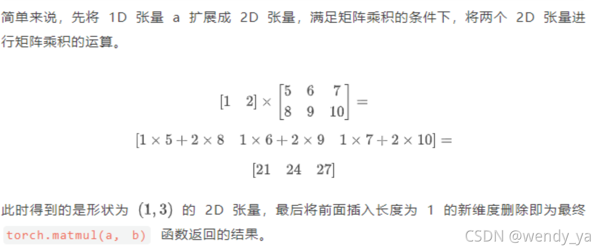

## 当输入的两个Tensor都至少是一维的且至少有一个是N维的(N>2)

> [numpy中stack函数的用法 - 知乎 (zhihu.com)](https://zhuanlan.zhihu.com/p/451587522)
>
> [numpy中二维张量乘三维张量是如何计算的_np 三维乘2维_属于我自己的光的博客-CSDN博客](https://blog.csdn.net/qq_37200100/article/details/118253150)

- 此时，就需要区分**矩阵维度**(`matrix dimensions`)和**批量维度**(`non-matrix` (i.e. batch) `dimensions`)
- 如果某一个Tensor是一维的，则按照上面说的，给那个一维的Tensor前面或者后面增加一个长度为`1`的新维度(根据这个Tensor是`input`，还是`other`来决定在前面还是在后面增加)
- 针对多维张量，我们只关注每个张量的后两个维度，**<u>将每个张量的后两个维度按照矩阵乘积进行运算</u>**，其余的维度都可以认为是**<u>批量维度</u>**。
- 接下来看看具体的例子，来理解：

### 三维与一维的乘法

- `input`为`(10,3,4)`，`other`为`(4)`
  - 计算过程：将`(4)`变成`(4,1)`，然后用矩阵乘法计算：`(3,4) x (4,1)`，得`(3,1)`。`input`第一个维度是批量维度，理解为需要执行多少次矩阵乘法，具体而言就是：`(10,3,4)`表示有10个`(3,4)`，每一个`(3,4)`都要和`(4,1)`做矩阵乘法，总共做10次(但在计算的时候是一次计算十个，所以叫批量维度，即批量计算)，从而结果就是`(10,3,1)`，去掉增加的维度，得`(10,3)`
- `input`为`(4)`，`other`为`(10,4,3)`
  - 和上面类似的

### 二维与三维的乘法

- `input`为`(2,3)`，`other`为`(2,3,4)`时

  - 此时`input`被称为`broadcasted matrix`，`other`被称为`batched matrix`。因为`other`包含多个`(3,4)`，`input`要分别与这么多的`(3,4)`相乘，所以`input`被广播出去了。

  - 计算过程：将`input`分别与2个`(3,4)`相乘，最终的结果是`(2,2,4)`

    ```python
    # 二维张量 x 三维张量
    # 定义一个非随机的二维张量
    tensor1 = torch.tensor([[1, 2, 3], [4, 5, 6]])  # 2x3
    # 定义一个非随机的三维张量，纬度是2x3x4
    tensor2 = torch.tensor([[[1, 2, 3, 4], [5, 6, 7, 8], [9, 10, 11, 12]],
                            [[13, 14, 15, 16], [17, 18, 19, 20], [21, 22, 23, 24]]])  # 2x3x4
    # 二维张量与三维张量相乘
    tensor3 = torch.matmul(tensor1, tensor2)
    print(tensor3)
    print(tensor3.size())
    print("--------------------------")
    # 用numpy来验证
    tensor1 = tensor1.numpy()
    tensor2 = tensor2.numpy()
    tensor3_0 = np.matmul(tensor1, tensor2[0])
    tensor3_1 = np.matmul(tensor1, tensor2[1])
    tensor3 = np.stack((tensor3_0, tensor3_1), axis=0)
    print(tensor3)
    print(tensor3.shape)
    ```

    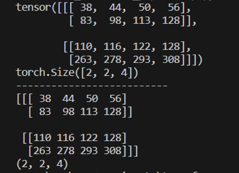

- `input`为`(2,3,4)`，`other`为`(4,2)`时，同上一条，结果为`(2,3,2)`

  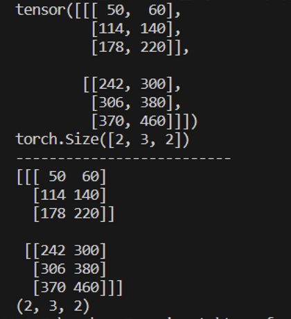

### 三维与三维的乘法

- `input`为`(1,2,3)`，`other`为`(2,3,4)`时

  - 和`二维x三维`的计算过程一样，即将`input`的唯一一个`(2,3)`分别和`other`里面两个`(3,4)`分别做矩阵乘法，然后返回。

    ```python
    # 三维张量 x 三维张量
    # 定义一个非随机的三维张量，纬度是1x2x3
    tensor1 = torch.tensor([[[1, 2, 3], [4, 5, 6]]])  # 1x2x3
    
    
    # 定义一个非随机的三维张量，纬度是2x3x4
    tensor2 = torch.tensor([[[1, 2, 3, 4], [5, 6, 7, 8], [9, 10, 11, 12]],
                            [[13, 14, 15, 16], [17, 18, 19, 20], [21, 22, 23, 24]]])  # 2x3x4
    # 二维张量与三维张量相乘
    tensor3 = torch.matmul(tensor1, tensor2)
    print(tensor3)
    print(tensor3.size())
    print("--------------------------")
    # 用numpy来验证
    tensor1 = tensor1.numpy()
    tensor2 = tensor2.numpy()
    tensor1_0 = tensor1[0]
    tensor2_0 = tensor2[0]
    tensor2_1 = tensor2[1]
    tensor3_0 = np.matmul(tensor1_0, tensor2_0)
    tensor3_1 = np.matmul(tensor1_0, tensor2_1)
    tensor3 = np.stack((tensor3_0, tensor3_1), axis=0)
    # tensor3_0 = np.matmul(tensor2[0], tensor1)
    # tensor3_1 = np.matmul(tensor2[1], tensor1)
    # tensor3 = np.stack((tensor3_0, tensor3_1), axis=0)
    print(tensor3)
    print(tensor3.shape)
    ```

    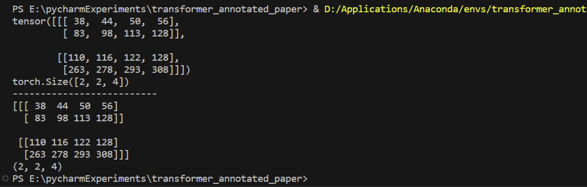

- `input`为`(2,3,4)`，`other`为`(1,4,2)`时

  - 和`二维x三维`的计算过程一样，即将`input`的两个`(3,4)`分别和`other`里面的唯一一个`(4,2)`分别做矩阵乘法，然后返回。

    ```python
    # 三维张量 x 三维张量
    # 定义一个非随机的三维张量，维度是1x4x2
    tensor1 = torch.tensor([[[1, 2], [3, 4], [5, 6], [7, 8]]])  # 1x4x2
    
    
    # 定义一个非随机的三维张量，维度是2x3x4
    tensor2 = torch.tensor([[[1, 2, 3, 4], [5, 6, 7, 8], [9, 10, 11, 12]],
                            [[13, 14, 15, 16], [17, 18, 19, 20], [21, 22, 23, 24]]])  # 2x3x4
    # 二维张量与三维张量相乘
    tensor3 = torch.matmul(tensor2, tensor1)
    print(tensor3)
    print(tensor3.size())
    print("--------------------------")
    # 用numpy来验证
    tensor1 = tensor1.numpy()
    tensor2 = tensor2.numpy()
    tensor1_0 = tensor1[0]
    tensor2_0 = tensor2[0]
    tensor2_1 = tensor2[1]
    tensor3_0 = np.matmul(tensor2_0, tensor1_0)
    tensor3_1 = np.matmul(tensor2_1, tensor1_0)
    tensor3 = np.stack((tensor3_0, tensor3_1), axis=0)
    # tensor3_0 = np.matmul(tensor2[0], tensor1)
    # tensor3_1 = np.matmul(tensor2[1], tensor1)
    # tensor3 = np.stack((tensor3_0, tensor3_1), axis=0)
    print(tensor3)
    print(tensor3.shape)
    
    ```

    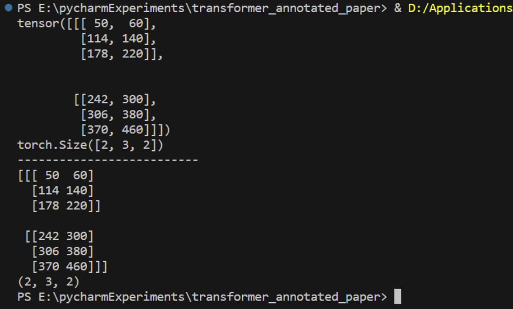

- `input`为`(2,3,4)`，`other`为`(2,4,2)`时

  - 和上面一个的思路不一样了。不是将`input`中的两个`(3,4)`分别与`other`中的两个`(4,2)`分别相乘的到四个结果，然后堆叠起来

  - **<u>正确思路为</u>**：`input`中的第一个`(3,4)`和`other`中的第一个`(4,2)`相乘，`input`中的第二个`(3,4)`和`other`中的第二个`(4,2)`相乘（即对应的做矩阵乘法），将两次相乘的结果堆叠起来，最终得到的结果是`(2,3,2)`。

    ```python
    # 三维张量 x 三维张量
    # 定义一个非随机的三维张量，维度是2x4x2
    tensor1 = torch.tensor([[[1, 2], [3, 4], [5, 6], [7, 8]], [[9, 10], [11, 12], [13, 14], [15, 16]]])  # 2x4x2
    
    
    # 定义一个非随机的三维张量，维度是2x3x4
    tensor2 = torch.tensor([[[1, 2, 3, 4], [5, 6, 7, 8], [9, 10, 11, 12]],
                            [[13, 14, 15, 16], [17, 18, 19, 20], [21, 22, 23, 24]]])  # 2x3x4
    # 二维张量与三维张量相乘
    tensor3 = torch.matmul(tensor2, tensor1)
    print(tensor3)
    print(tensor3.size())
    print("--------------------------")
    # 用numpy来验证
    tensor1 = tensor1.numpy()
    tensor2 = tensor2.numpy()
    tensor1_0 = tensor1[0]
    tensor1_1 = tensor1[1]
    tensor2_0 = tensor2[0]
    tensor2_1 = tensor2[1]
    tensor3_0 = np.matmul(tensor2_0, tensor1_0)
    tensor3_1 = np.matmul(tensor2_1, tensor1_1)
    tensor3 = np.stack((tensor3_0, tensor3_1), axis=0)
    # tensor3_0 = np.matmul(tensor2[0], tensor1)
    # tensor3_1 = np.matmul(tensor2[1], tensor1)
    # tensor3 = np.stack((tensor3_0, tensor3_1), axis=0)
    print(tensor3)
    print(tensor3.shape)
    ```

    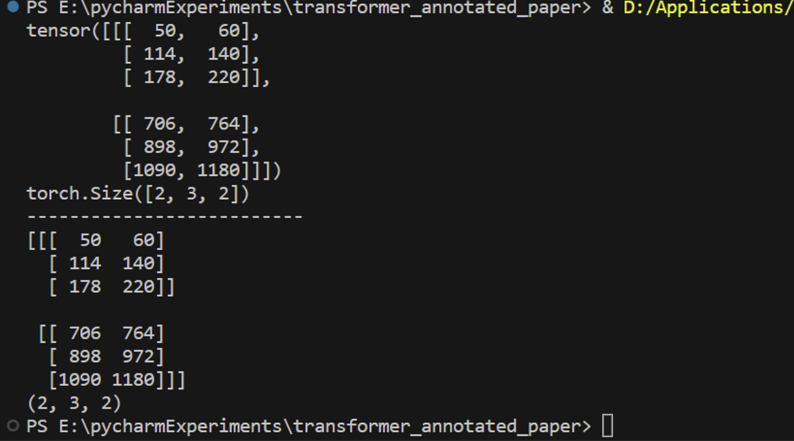

  - 因此，需要注意，当`input`和`other`都是三维的，且第一个维度都大于1时，**<u>两个Tensor的第一个维度必须相等</u>**，否则无法计算。如下面的例子所示，会报错。

    ```python
    # 三维张量 x 三维张量
    # 定义一个非随机的三维张量，维度是3x4x2
    tensor1 = torch.tensor([[[1, 2], [3, 4], [5, 6], [7, 8]],
                            [[9, 10], [11, 12], [13, 14], [15, 16]],
                            [[17, 18], [19, 20], [21, 22], [23, 24]]])  # 3x4x2
    
    
    
    # 定义一个非随机的三维张量，维度是2x3x4
    tensor2 = torch.tensor([[[1, 2, 3, 4], [5, 6, 7, 8], [9, 10, 11, 12]],
                            [[13, 14, 15, 16], [17, 18, 19, 20], [21, 22, 23, 24]]])  # 2x3x4
    # 二维张量与三维张量相乘
    tensor3 = torch.matmul(tensor2, tensor1)
    print(tensor3)
    print(tensor3.size())
    print("--------------------------")
    ```

    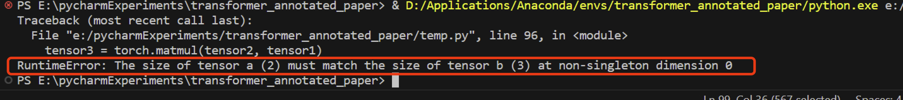

### 四维与三维的乘法


- `input`为`(2,1,4,3)`，`other`为`(2,3,4)`时

  - `input`中的第一个2相当于`batch`，理解为两条数据（即同时处理两条数据）

  - 每条数据都是`(1,4,3)`，因此就变成了“**分别计算两条数据与other的乘法，然后堆叠起来**”。

  - 于是问题转化为计算`(1,4,3)x(2,3,4)`。计算方法详见三维与三维的乘法。

    ```python
    # 四维张量 x 三维张量
    # 定义一个非随机的三维张量，维度是2x1x4x3
    tensor1 = torch.tensor([[[[1, 2, 3], [4, 5, 6], [7, 8, 9], [10,11,12]]],
                            [[[13, 14, 15], [16, 17, 18], [19, 20, 21], [22,23,24]]]])  # 2x1x4x3
    
    
    
    
    # 定义一个非随机的三维张量，维度是2x3x4
    tensor2 = torch.tensor([[[1, 2, 3, 4], [5, 6, 7, 8], [9, 10, 11, 12]],
                            [[13, 14, 15, 16], [17, 18, 19, 20], [21, 22, 23, 24]]])  # 2x3x4
    # 四维张量与三维张量相乘
    tensor3 = torch.matmul(tensor1, tensor2)
    print(tensor3)
    print(tensor3.size())
    print("--------------------------")
    ```

    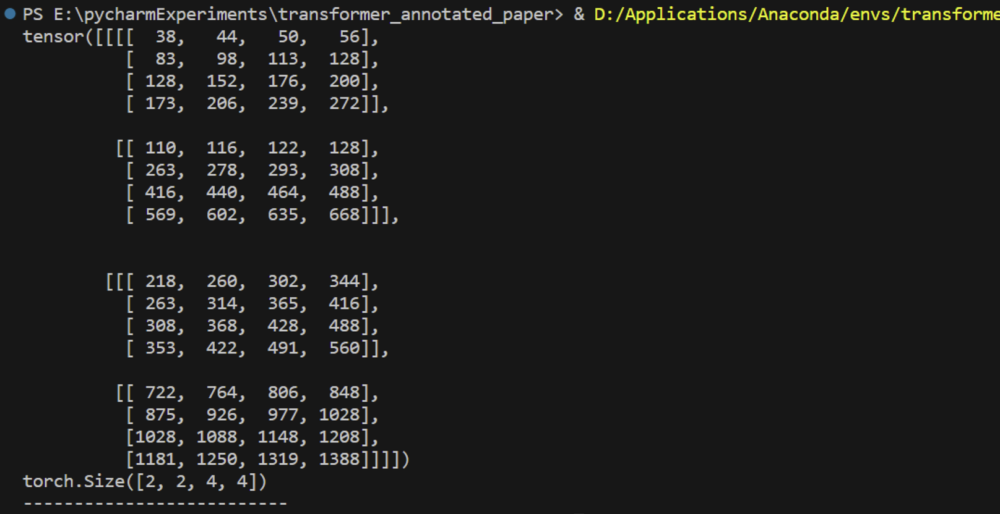

- 倒过来，`input`为`(2,3,4)`，`other`为`(2,1,4,3)`时

  - 计算方法类似

    ```python
    # 四维张量 x 三维张量
    # 定义一个非随机的三维张量，维度是2x1x4x3
    tensor1 = torch.tensor([[[[1, 2, 3], [4, 5, 6], [7, 8, 9], [10,11,12]]],
                            [[[13, 14, 15], [16, 17, 18], [19, 20, 21], [22,23,24]]]])  # 2x1x4x3
    
    
    
    
    # 定义一个非随机的三维张量，维度是2x3x4
    tensor2 = torch.tensor([[[1, 2, 3, 4], [5, 6, 7, 8], [9, 10, 11, 12]],
                            [[13, 14, 15, 16], [17, 18, 19, 20], [21, 22, 23, 24]]])  # 2x3x4
    # 四维张量与三维张量相乘
    tensor3 = torch.matmul(tensor2, tensor1) # 改了这里
    print(tensor3)
    print(tensor3.size())
    print("--------------------------")
    ```

    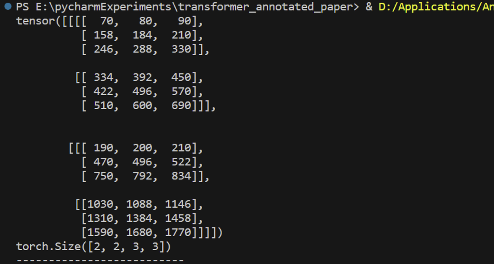

- 类似地，`input`为`(2,2,4,3)`，`other`为`(2,3,4)`时

  - `input`中的第一个2相当于`batch`，理解为两条数据（即同时处理两条数据）

  - 每条数据都是`(2,4,3)`，因此就变成了“**分别计算两条数据与other的乘法，然后堆叠起来**”。

  - 于是问题转化为计算`(2,4,3)x(2,3,4)`。计算方法详见三维与三维的乘法。

    ```python
    # 四维张量 x 三维张量
    # 定义一个非随机的三维张量，维度是2x2x4x3
    tensor1 = torch.tensor([[[[1, 2, 3], [4, 5, 6], [7, 8, 9], [10,11,12]],[[13, 14, 15], [16, 17, 18], [19, 20, 21], [22,23,24]]],
                            [[[25, 26, 27], [28, 29, 30], [31, 32, 33], [34,35,36]],[[37, 38, 39], [40, 41, 42], [43, 44, 45], [46,47,48]]]])  # 2x2x4x3
    
    # 定义一个非随机的三维张量，维度是2x3x4
    tensor2 = torch.tensor([[[1, 2, 3, 4], [5, 6, 7, 8], [9, 10, 11, 12]],
                            [[13, 14, 15, 16], [17, 18, 19, 20], [21, 22, 23, 24]]])  # 2x3x4
    # 四维张量与三维张量相乘
    tensor3 = torch.matmul(tensor1, tensor2)
    print(tensor3)
    print(tensor3.size())
    print("--------------------------")
    ```

    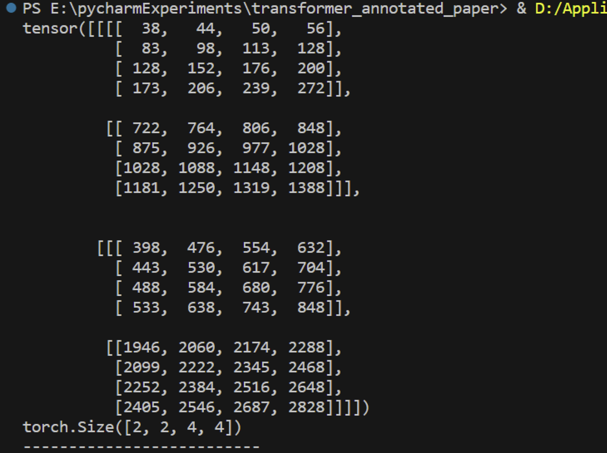

  - 反过来，`input`为`(2,3,4)`，`other`为`(2,2,4,3)`时，也是一样的道理。

### 四维与四维的乘法

> - 思想
>   - 计算时，把除了最后两个维度之外的其他维度视为`batch`
>   - 而根据三维乘三维的经验（三维时第一个维度是`batch`维度，要么相等，要么一个`1`一个`非1`；相等时对应相乘，不相等时进行广播分配相乘）,四维乘四维时，第一个维度也应该要么相等要么一个`1`一个`非1`

- 此时包含如下的几种可能情况

  - `(j,1,n,m)x(j,1,m,p)`

    - 例如，`(2,1,4,3)x(2,1,3,2)`，结果为`(2,1,4,2)`

      ```python
      # 定义一个非随机的四维张量，维度是2x1x4x3
      tensor1 = torch.tensor([[[[1, 2, 3], [4, 5, 6], [7, 8, 9], [10,11,12]]],
                              [[[13, 14, 15], [16, 17, 18], [19, 20, 21], [22,23,24]]]])  # 2x1x4x3
      
      # 定义一个非随机的四维张量，维度是2x1x3x2
      tensor2 = torch.tensor([[[[1, 2], [3, 4], [5, 6]]],
                              [[[7, 8], [9, 10], [11, 12]]]])  # 2x1x3x2
      # 四维张量与三维张量相乘
      tensor3 = torch.matmul(tensor1, tensor2)
      print(tensor3)
      print(tensor3.size())
      print("--------------------------")
      ```

      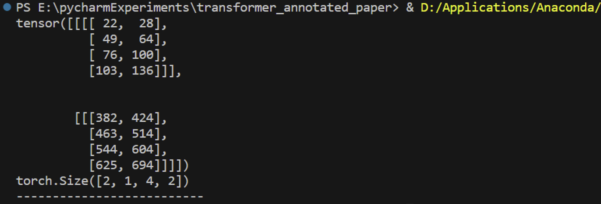

  - `(j,1,n,m)x(j,k,m,p)`

    - 例如，`(2,1,4,3)x(2,2,3,2)`，结果为`(2,2,4,2)`

      ```python
      # 定义一个非随机的四维张量，维度是2x1x4x3
      tensor1 = torch.tensor([[[[1, 2, 3], [4, 5, 6], [7, 8, 9], [10,11,12]]],
                              [[[13, 14, 15], [16, 17, 18], [19, 20, 21], [22,23,24]]]])  # 2x1x4x3
      
      # 定义一个非随机的四维张量，维度是2x2x3x2
      tensor2 = torch.tensor([[[[1, 2], [3, 4], [5, 6]],
                                  [[7, 8], [9, 10], [11, 12]]],
                              [[[13, 14], [15, 16], [17, 18]],
                                  [[19, 20], [21, 22], [23, 24]]]])  # 2x2x3x2
      # 四维张量与三维张量相乘
      tensor3 = torch.matmul(tensor1, tensor2)
      print(tensor3)
      print(tensor3.size())
      print("--------------------------")
      ```

      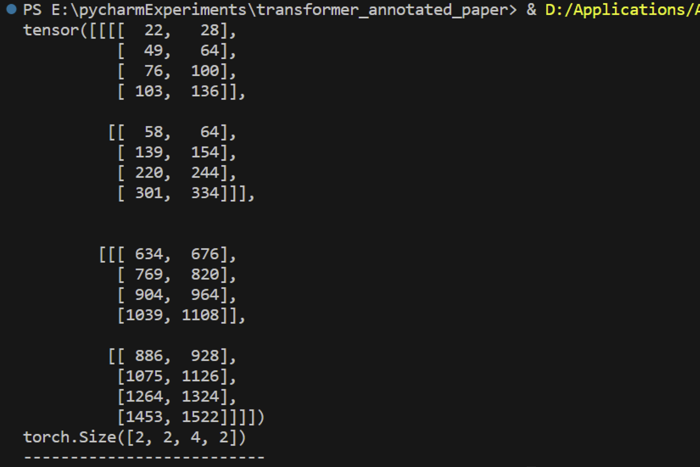

  - `(j,k,n,m)x(j,1,m,p)`

    - 例如，`(2,2,4,3)x(2,1,3,2)`，结果为`(2,2,4,2)`

      ```python
      # 定义一个非随机的四维张量，维度是2x2x4x3
      tensor1 = torch.tensor([[[[1, 2, 3], [4, 5, 6], [7, 8, 9], [10,11,12]],
                                  [[13, 14, 15], [16, 17, 18], [19, 20, 21], [22,23,24]]],
                              [[[25, 26, 27], [28, 29, 30], [31, 32, 33], [34,35,36]],
                                  [[37, 38, 39], [40, 41, 42], [43, 44, 45], [46,47,48]]]])  # 2x2x4x3
      
      # 定义一个非随机的四维张量，维度是2x1x3x2
      tensor2 = torch.tensor([[[[1, 2], [3, 4], [5, 6]]],
                              [[[7, 8], [9, 10], [11, 12]]]])  # 2x1x3x2
      # 四维张量与三维张量相乘
      tensor3 = torch.matmul(tensor1, tensor2)
      print(tensor3)
      print(tensor3.size())
      print("--------------------------")
      ```

      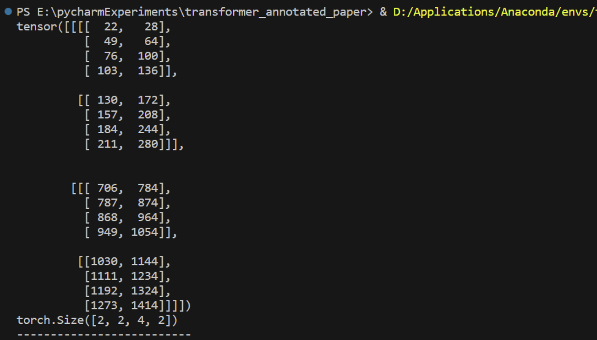

  - `(j,k,n,m)x(j,k,m,p)`

    - 例如，`(2,2,4,3)x(2,2,3,2)`，结果为`(2,2,4,2)`

      ```python
      # 定义一个非随机的四维张量，维度是2x2x4x3
      tensor1 = torch.tensor([[[[1, 2, 3], [4, 5, 6], [7, 8, 9], [10,11,12]],
                                  [[13, 14, 15], [16, 17, 18], [19, 20, 21], [22,23,24]]],
                              [[[25, 26, 27], [28, 29, 30], [31, 32, 33], [34,35,36]],
                                  [[37, 38, 39], [40, 41, 42], [43, 44, 45], [46,47,48]]]])  # 2x2x4x3
      
      # 定义一个非随机的四维张量，维度是2x2x3x2
      tensor2 = torch.tensor([[[[1, 2], [3, 4], [5, 6]],
                                  [[7, 8], [9, 10], [11, 12]]],
                              [[[13, 14], [15, 16], [17, 18]],
                                  [[19, 20], [21, 22], [23, 24]]]])  # 2x2x3x2
      
      # 四维张量与三维张量相乘
      tensor3 = torch.matmul(tensor1, tensor2)
      print(tensor3)
      print(tensor3.size())
      print("--------------------------")
      ```

      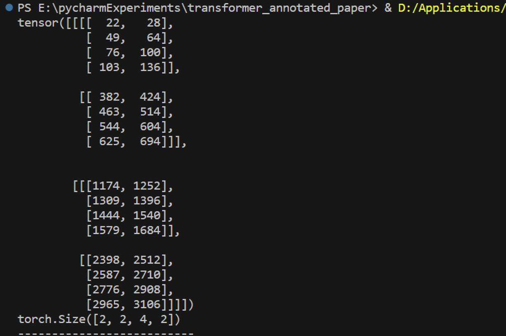

  - 对于`(j,k,n,m)x(g,k,m,p)`，其中$j\neq{g}$时，和三维乘三维的乘法一样，会报错。如下面这个例子所示。

    ```python
    # 定义一个非随机的四维张量，维度是2x2x4x3
    tensor1 = torch.tensor([[[[1, 2, 3], [4, 5, 6], [7, 8, 9], [10,11,12]],
                                [[13, 14, 15], [16, 17, 18], [19, 20, 21], [22,23,24]]],
                            [[[25, 26, 27], [28, 29, 30], [31, 32, 33], [34,35,36]],
                                [[37, 38, 39], [40, 41, 42], [43, 44, 45], [46,47,48]]]])  # 2x2x4x3
    
    # 定义一个非随机的四维张量，维度是3x2x3x2
    tensor2 = torch.tensor([[[[1, 2], [3, 4], [5, 6]],
                                [[7, 8], [9, 10], [11, 12]]],
                            [[[13, 14], [15, 16], [17, 18]],
                                [[19, 20], [21, 22], [23, 24]]],
                            [[[25, 26], [27, 28], [29, 30]],
                                [[31, 32], [33, 34], [35, 36]]]])  # 3x2x3x2
    
    # 四维张量与三维张量相乘
    tensor3 = torch.matmul(tensor1, tensor2)
    print(tensor3)
    print(tensor3.size())
    print("--------------------------")
    ```

    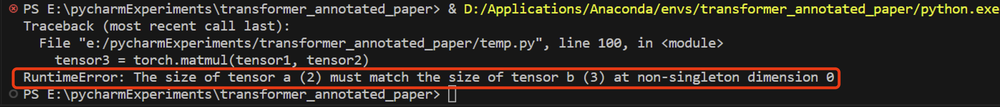

# 总结

1. `一维乘一维`是向量的点积，即对应元素相乘再相加
2. `二维乘二维`是矩阵的乘法运算
   1. 若存在某一个Tensor是一维的，则根据该Tensor所处的位置，增加一个长度为`1`的维度，算完之后再把新加的维度删掉
   2. 增加维度的目的就是把一维的Tensor变成一个严格意义上的行向量或者列向量，方便与矩阵进行相乘
3. `三维乘三维`&`四维乘四维`时除了最后两个维度，其余维度称为`batch`，需要按层次分解，每一个维度的`batch`要么是`1`，要么`非1`；是`1`的时候需要进行广播(broadcast)，`非1`的时候必须两个Tensor在该维度上相等，且遵循对应相乘
4. 在transformer中，计算注意力时，存在两个Tensor
   1. 一个Tensor是`p_attn`，维度为`(nbatches, self.h, -1_seq_length, -1_seq_length_prob)`，
   2. 一个是`value`，维度为`(nbatches, self.h, -1_seq_length, self.d_k)`
   3. `torch.matmul(p_attn, value)`：`nbatches`相当于一次性读取的数据条数，对于每一条数据，总共有`self.h`个头，每个头的`(-1_seq_length, -1_seq_length_prob)`和`(-1_seq_length, self.d_k)`分别对应做矩阵乘法