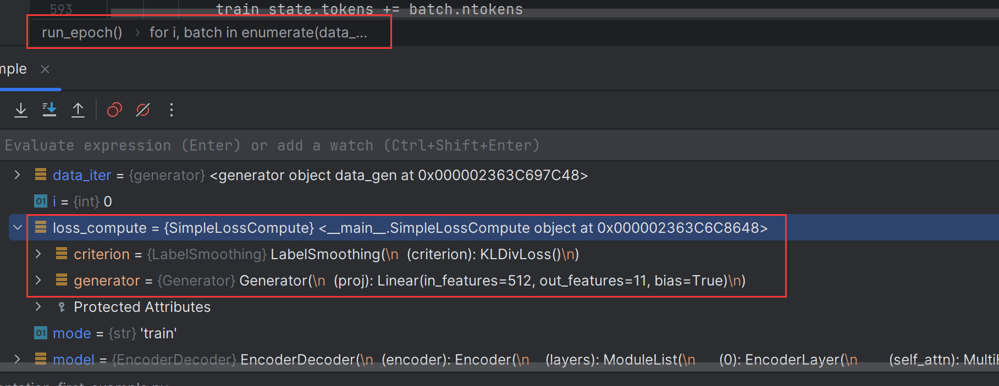
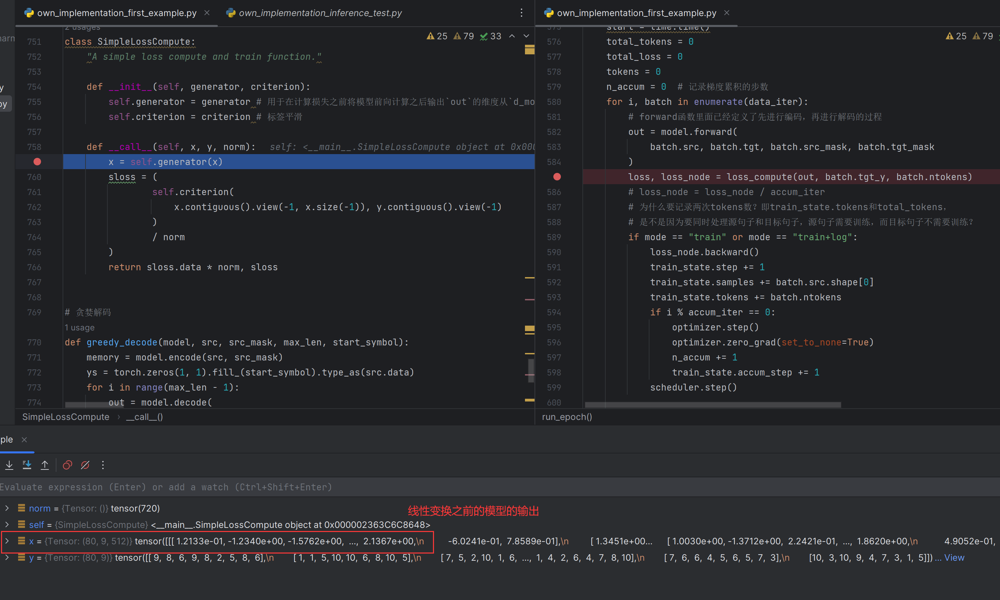
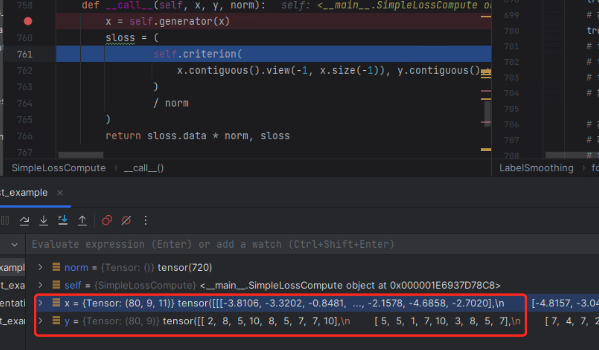
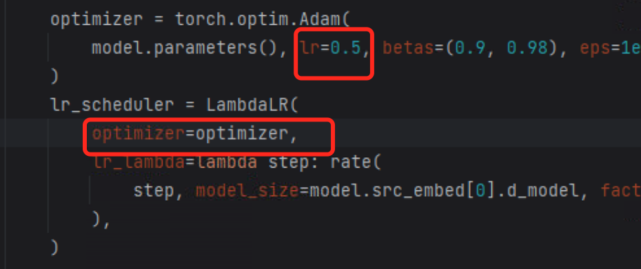
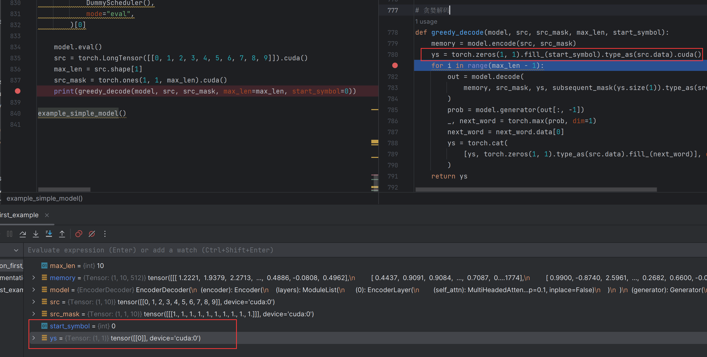
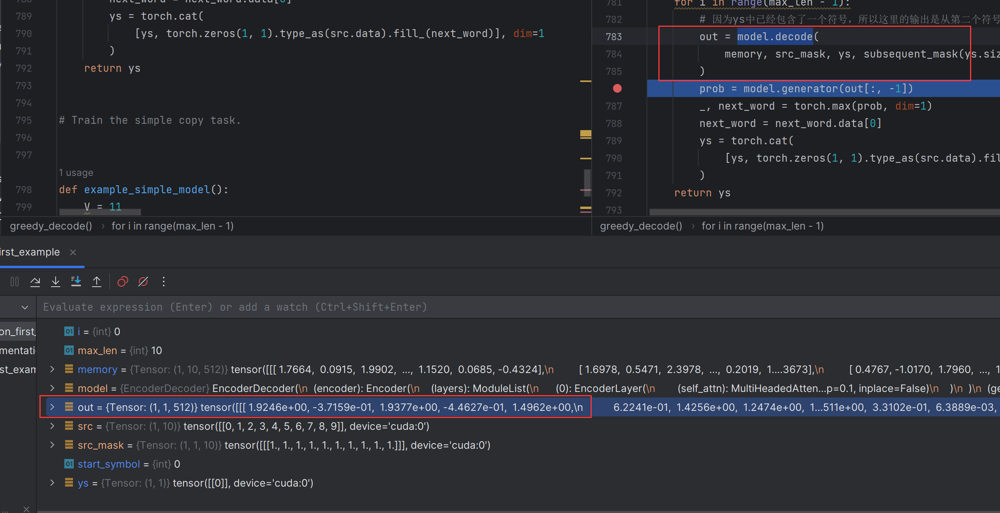
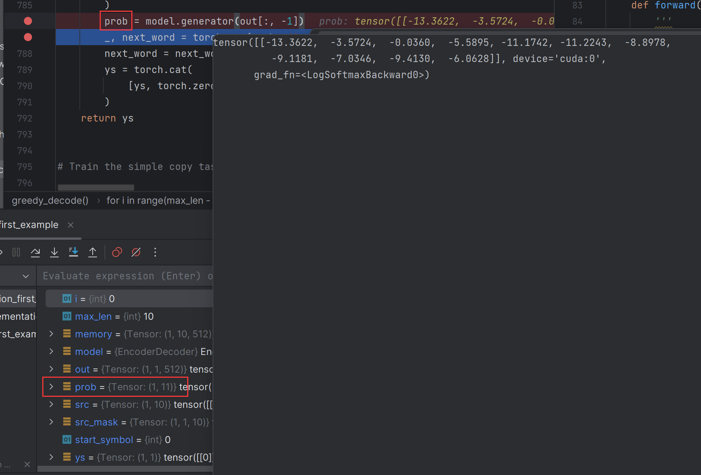
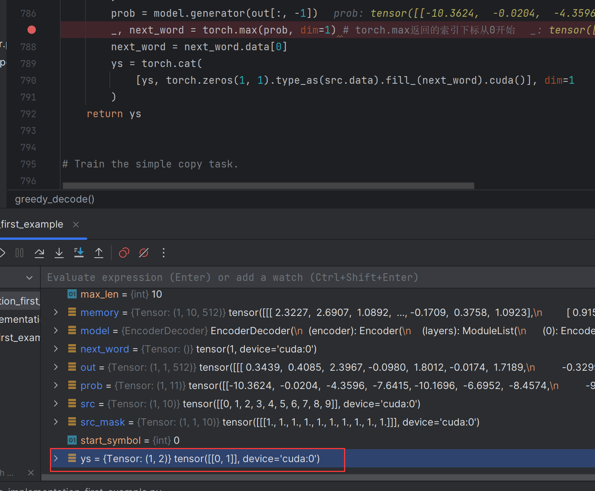
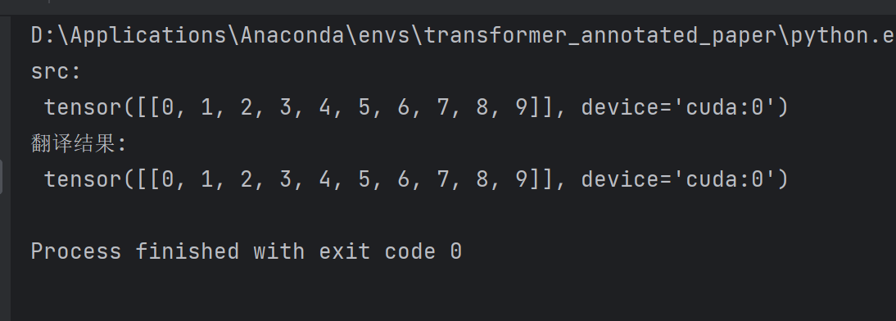

-----建议将文件和对应的assets下载查看，因为本文件中有几个示例短视频，在github上无法播放
# 1一些必要的项

1. 词表大小：这里设置为`11`
2. 标签平滑(<font color="red">详见单独的标签平滑的笔记</font>)：这里平滑因子直接设置成了`0`
3. 自适应学习率优化器
4. 模型结构：两个编码器层+两个解码器层
5. 批处理大小：`80`

# 2训练

> 总共迭代`20`轮，每一轮都是：训练+评估
>
> 每一次迭代，训练和评估都会去生成数据

## 2.1数据生成

根据调试过程，代码会先进入到`run_epoch`函数中，当执行到`for i, batch in enumerate(data_iter):`时才会调用`data_gen`函数进行数据生成；并且，逻辑是：先生成一批数据，然后进行模型训练等操作，操作做完之后，再生成一批数据，然后再进行系列操作。

1. 在数据生成函数中，用到了生成器函数`yield`
   1. 生成器函数可以像普通函数一样定义，但是当调用生成器函数时，它并不会立即执行函数体，而是返回一个生成器对象。每次调用生成器对象的`__next__()`方法时，生成器函数会从上一次暂停的位置继续执行，直到遇到`yield`关键字，然后将`yield`后面的值返回给调用者，并再次暂停
   1. 那放到这里个例子里面来，可以理解为：调用`data_gen`时执行了`yield Batch(src, tgt, 0)`语句，但是并没有立马执行函数体，但是紧接着就是`for i, batch in enumerate(data_iter)`，调用了`yield`关键字返回的生成器对象，因而看上去就是：在调用了`data_gen`又调用了`Batch`类生成数据了。（暂时就这么理解）

2. 下面看一下生成第一批数据的过程：

   1. `data`维度：`(80,10)`，即`80`条数据，每条数据包含`10`个元素，每个元素都是`大于等于1`，`小于词表大小V`

   2. 将所有句子的开头设置为这个特殊符号。这里特殊符号在词表中的值为`1`。

   3. 用`data`生成相同的`src`和`tgt`

      1. `detach()`函数用于从计算图中分离张量，使得张量不再与计算图产生关联。`detach()`函数会返回一个新的张量，其值与原始张量相同。
      2. 输入和输出数据不需要计算梯度，因此使用了`requires_grad_(False)`

      

   4. 然后生成一个`batch`对象

      1. `src_mask`：`src`中等于填充符的元素相应的设置为`False`。所以在<font color="red">后面讲到评估模式下transformer的计算过程</font>时，`src_mask`不是没有用，在实际使用时句子里面会加上一些特殊的填充符，而`src_mask`的存在，使得评分张量`scores`中的对应位置的值无穷小，softmax之后的概率就趋近于`0`，然后计算`P_attn*values`时就不会把填充符的信息考虑进来了。
      2. `unsqueeze(-2)`：在指定位置插入一个新的维度。在这个代码中，`unsqueeze(-2)`的作用是在倒数第二个维度上插入一个新的维度，这个新的维度的大小为`1`。因此`src_mask`维度就从`(80,10)`变成了`(80,1,10)`。
         1. 注意：填充符和前面生成数据时说的开始符号作用不一样，填充符除了起到将句子变得一样长以外就没有什么其他作用了，而开始标记应该是有用的(目前还不清楚，还没学习到，但是想到在BERT里面句子开头的`[CLS]`标记在后面就有分类的用途)，所以在`src_mask`中只是将填充符对应的位置设置了`False`。
      3. 分别获取`tgt`和`tgt_y`，前者去掉目标语言句子中的结束符，后者去掉目标语言句子中的开始符。前者用于计算目标语言句子中每个单词的预测概率，后者用于计算目标语言句子中每个单词的真实概率。（至于为什么这么做，目前还不是很明白）
         1. `tgt`中去掉结束符而保留开始符的原因：
      
      1. `tgt_mask`：因为是目标序列的掩码张量，所以除了要像源序列那样，把填充符遮蔽掉以外，还需要将后续的位置也给遮蔽掉，所以代码中分了两个部分去计算
         1. 用于遮蔽填充符的`tgt_mask`：维度是`(80,1,9)`。和`src_mask`一样，将填充符所在位置设置为`False`。
         2. 用于遮蔽后续位置的`subsequent_mask`：`subsequent_mask`函数返回的掩码张量维度是`(1,9,9)`，主对角线及以下部分的值为`1`，主对角线以上部分全为`0`。对每条数据而言，只要数据的长度定下来了，掩码张量就定下来了。
         3. 按位与运算`&`：两个数都为1结果才为1。
            1. 最后得到的掩码张量维度是`(80,9,9)`，即得到每条数据的掩码张量
            2. 运算过程可以理解为：某条数据中如果有一个位置是填充符(即该位置上的`tgt != pad`判定值为`False`)，而该位置在`subsequent_mask`中为`1`，则两者相与为`0`，意思是解码时仍然不需要去考虑这个位置，即使这个位置在预测当前词时属于前面的位置，因为该位置是填充符。
      2. 计算非填充符的token数：使用的是去掉开始符的`tgt_y`。（等理解了为什么`tgt`保留了开始符，`tgt_y`保留了结束符之后就可以理解为啥这里用`tgt_y`）了。

<u>到此，就完成了第一批数据的生成。之后的每一批数据的生成都是如此</u>。

## 2.2模型输出计算

1. 对于当前生成的一批数据，输入到transformer模型中，进行编码和解码的计算
   1. 具体的计算过程<font color="red">会在后续的视频中详细讲述</font>，目前只关注得到了什么输出
      1. <font color="red">这个例子里面输入到transformer中的`src`和`tgt`的长度不一样，一个是`10`，一个是`9`，而`vocab`大小为`11`，那`embedding`的时候怎么弄的</font>？
   2. 源语言序列输入到模型中，最终是服务于解码序列的生成的，因此重点还是目标语言序列输入到解码器之后得到的输出
2. `out = model.forward(batch.src, batch.tgt, batch.src_mask, batch.tgt_mask)`：
   1. 输入进去的`batch.tgt`是`self.tgt = tgt[:, :-1]`，即去掉了结束符的目标语言序列
   2. 计算之后，`out`的维度是`(80,9,512)`
      1. `80`：代表一个`Batch`的数据条数
      2. `9`：代表每条数据的`9`个元素
      3. `512`：代表每条数据中的每个元素对应着一个特征向量，这个特征向量的长度是`512`维

## 2.3损失计算

1. 在调用`run_epoch`函数时，同时传入了损失计算函数：`SimpleLossCompute(model.generator, criterion)`。上面已经捋了一下数据生成函数`data_gen`是在`run_epoch`函数之前还是之后，那`SimpleLossCompute`对象的创建是在进入`run_epoch`之前还是之后呢，是在`data_gen`之前还是之后呢

   1. 在`run_epoch`内、`SimpleLossCompute`内、`data_gen`内分别打一个断点，然后调试，发现执行顺序为：

      1. 先调用`SimpleLossCompute`类建立`SimpleLossCompute`对象
      2. 再进入到`run_epoch`函数内
      3. 然后再生成数据

      <video id="video" controls="" src="transformer_a_first_example.assets/2023-06-29 16-27-30.mp4" preload="none">
      [](https://www.youtube.com/watch?v=l8Myt8XJ-YY "")

### 2.3.1建立`SimpleLossCompute`对象

1. 将标签平滑对象`criterion`和transformer的`generator`传入`SimpleLossCompute`用于后续的损失计算，如下图所示。

   1. transformer的`generator`：用于在计算损失之前将模型前向计算之后输出`out`的维度从`d_model`变成`vocab_size`
   2. `criterion`：在计算损失前，对模型的输出，即预测结果进行平滑操作，泛化标签，防止过拟合，提高模型泛化能力。

   

   

### 2.3.2计算损失

1. 将维度为`(80,9,512)`的模型的输出经过线性变换和`log_softmax`之后，变成了概率，维度是`(80,9,11)`，如下面两张图所示。

   

   

2. 计算损失：在`SimpleLossCompute`中，调用`self.criterion`对象(该对象其实是`LabelSmoothing`对象)，于是会自动调用`LabelSmoothing`对象的`forward`方法，如下图所示

   1. `forward`方法的第一个参数`x`对应于之前模型的输出`out`；第二个参数为`batch.tgt_y`，即去掉开始符的目标语言序列；
   
      1. 会将传入的两个参数先进行`contiguous()`操作，将两个张量变成连续的张量(`contiguous()`函数会返回一个连续的张量，这样做是因为在深度学习中，连续的张量通常比不连续的张量更容易进行计算，因为它们在内存中的存储顺序与张量的逻辑顺序相同，可以更好地利用硬件加速器的优化)，接着使用`view`方法返回一个新的张量，这个新的张量的形状得到了改变
   
         1. 如下两张图所示，`view`之前`x`的维度是`(80,9,11)`，`view`之后的维度变成二维的张量，第二个维度的大小为`11`，第一个维度自动计算，即得到`720`，即`view`之后的维度是`(720,11)`，每一行表示这些句子的每个词对应于词表的概率；
         2. `view`之前`y`的维度是`(80,9)`，`view`之后被展平成了一维的，即`(720,)`，表示这些句子里面每个词对应的词表的索引(即真实的标签)
   
         
   
         
   
   2. (<font color="red">标签平滑过程后续会单独说</font>)根据序列的真实分布对模型的预测输出进行标签平滑，然后用未平滑的输出和平滑之后用来代替真实数据分布的输出去计算损失(使用KL散度计算两者之间的差异，作为损失值)
   
      
   
   3. 下图是计算出来的损失值
   
      1. `norm` 就是传进来的`batch.ntokens`，就是真实的标签`tgt_y`中的有效元素的个数
      2. 然后返回两个损失值：一个是没有平均的(即`sloss.data * norm`，也即返回之后的`loss`)，另一个是平均了的损失(即`sloss`，也即返回之后的`loss_node`)；这里的平均是将所有预测的损失除以了这一批数据的词的个数，得到平均的损失。这里`norm=720`。<font color="red">后续会总的捋一遍`run_epoch`过程</font>。
   
      
   

## 2.4反向传播

1. `loss_node.backward()`

   1. 在PyTorch中，每个张量都有一个`backward()`方法，用于计算该张量对于计算图中所有需要梯度的张量的梯度，并将梯度累加到相应的张量中。如下图所示，调用`backward()`方法之后，`x`中的梯度信息就更新了，因此可以直接通过`x.grad`来查看梯度。（<font color="red">后续会单独尝试查看transformer的梯度</font>）

      

   2. 计算图是pytorch在进行模型的前向计算时生成的。(<font color="red">这里就暂时没有可视化transformer的计算图了，因为还需要安装`graphviz`，比较麻烦，后续会单独说</font>)。比如说在使用线性层对输入进行线性变换的时候，会包含有线性层的参数矩阵。

## 2.5记录训练信息&参数更新

1. 用到`TrainState`类

   1. `step`：用`step`记录当前训练的步数，目前是`1`
   2. `samples`：从`src`中获取当前累计训练了多少数据，目前是`80`条数据
   3. `tokens`：从`Batch`中获取当前训练的token数，目前是`720`
      1. 注意：因为前面说了，这个例子中生成的`data`是不包含填充符的，所以都是有效token，所以是`80*9`
   4. `accum_step`：记录参数更新的次数。<u>目前这个例子中尚未看出该变量和`n_accum`的区别</u>。

2. `accum_iter`：记录梯度累计的次数。

   1. 在训练过程中，如果`batch size`比较小，可能会导致梯度下降的方向不够准确，从而影响模型的训练效果。为了解决这个问题，可以采用梯度累积的方法，即将多个batch的梯度累加起来，再进行一次参数更新。

   ```python
   class TrainState:
       """Track number of steps, examples, and tokens processed"""
   
       step: int = 0  # Steps in the current epoch
       accum_step: int = 0  # Number of gradient accumulation steps
       samples: int = 0  # total of examples used
       tokens: int = 0  # total of tokens processed
   ```

   

3. 按照设置的梯度累计次数来更新模型参数

   1. 本次的例子中，`accum_iter=1`，即每一次都更新一下参数

   2. 具体而言，使用`optimizer.step()`语句来实现参数的更新

      1. 在构建优化器时，已经将transformer模型的模型参数传入了，如下图所示

         

4. 然后使用`optimizer.zero_grad(set_to_none=True)`清空优化器中的梯度信息，以便进行下一轮的梯度计算和参数更新

   1. `set_to_none=True`表示将梯度张量的值设置为`None`，以释放内存

5. 更新`参数更新次数`

   

6. 然后执行`scheduler.step()`

   1. 在构建学习率调度器的时候就传入了要使用的优化器，且构建优化器时初始的学习率也设置了，如下图所示

      1. 但是，在创建了学习率调度器之后，就对学习率进行了第一次调整(即调用了`rate`函数对学习率进行了调整)，如下第二张图所示，学习率发生了变化。如下的视频也说明了这个情况。

      

      

      <video id="video" controls="" src="transformer_a_first_example.assets/2023-07-01 20-04-43.mp4" preload="none">
   
   2. 这句话的作用：使用学习率调度器（scheduler）来更新优化器（optimizer）的学习率
   
      1. transformer中学习率在最初的预热steps是线性增加的，并在此后按步长的反平方根比例递减。（<font color="red">后续会单独说一下学习率的优化过程</font>。）
      
      2. 下面这个视频显示了学习率更新的过程。
      
         <video id="video" controls="" src="transformer_a_first_example.assets/2023-07-01 20-49-09.mp4" preload="none">

7. 记录所有Batch数据的损失和token数（不论当前`epoch`是否是训练状态，都会去记录）
   1. `total_loss`：当前`epoch`中所有Batch数据的累计损失，损失未平均，直接相加。
   1. `total_tokens`：当前`epoch`中所有Batch数据的目标序列的累计有效token数。用于最后计算当前`epoch`的平均损失。
   1. `tokens`：记录的内容和`total_tokens`一样。用于计算单位时间处理的token数。每当计算了单位时间处理的token数，`tokens`就重新置为0，重新计数。

## 2.6打印日志信息并返回结果

1. 在训练的时候才会有参数更新，因此日志信息只输出训练情况下的信息
2. 这里是每`40`个`Batch`打印一次日志信息（实际上，这个例子只有`20`个`Batch`）
   1. `if i % 40 == 1`：这是原文给的代码，并不能够实现“每`40`个`Batch`打印一次日志信息”
   2. 所以修改为了：`if (i + 1) % 40 == 0`。
3. 打印信息如下
   1. `i`：当前正在处理的Batch数据对应的下标
   2. `n_accum`：到目前为止，当前`epoch`进行参数更新的次数
   3. `loss / batch.ntokens`：当前Batch数据的损失(因为最后通过`del loss`和`del loss_node`删除了损失)除以当前Batch的有效token数，即当前Batch数据的平均损失。
   4. `tokens / elapsed`：处理这`40`个Batch数据，单位时间内处理的token数
   5. `lr`：学习率
4. 打印完日志之后，将时间清空，将有效token数清空。
5. 最后返回损失数据和训练情况(但是这个例子中，并没有接收返回结果)
   1. `total_loss / total_tokens`：当前这个`epoch`的平均损失(训练和非训练模式下都有)
   2. `train_state`：当前这个`epoch`的训练状态信息(只在训练模式下才会计算，非训练模式下类中的变量都是`0`)

# 3评估

1. 使用`model.eval()`让模型处于评估状态

2. 评估时和训练时一样，也是调用`run_epoch`函数，合成数据，进行模型的前向计算，计算损失；但是没有梯度的计算、参数的更新、学习率的调整

   1. `DummyOptimizer`和`DummyScheduler`是定义的占位符，实际没有作用，是两个虚拟的优化器和学习率调度器，便于训练和评估使用同一个`run_epoch`函数入口。其定义如下所示

      ```python
      class DummyOptimizer(torch.optim.Optimizer):
          def __init__(self):
              self.param_groups = [{"lr": 0}]
              None
      
          def step(self):
              None
      
          def zero_grad(self, set_to_none=False):
              None
      
      
      class DummyScheduler:
          def step(self):
              None
      ```

   2. 之所以在`DummyOptimizer`的初始化中定义学习率为`0`，是为了保持与PyTorch中的优化器类的接口一致。在PyTorch中，优化器类的初始化函数通常需要指定学习率和其他超参数，以便于在优化过程中使用。

3. 评估时的计算过程和训练时一样，实际评估时肯定要对返回来的结果进行一些记录和后续的分析，但是这个例子中暂时没有涉及到。

# 4预测

1. 由于使用CPU比较慢，调试起来也不方便，因此对这个例子的相关内容进行调整，以便在GPU上进行训练，通过查阅资料，发现需要调整三部分内容：模型、数据、损失函数

   1. 模型：在示例一开始构建模型的地方将建立的模型放入到GPU

      ```python
      model = make_model(V, V, N=2)
      model.cuda()
      ```

   2. 损失函数：在最初构建损失函数的地方，即`LabelSmoothing`类初始化的地方，将`self.criterion = nn.KLDivLoss(reduction="sum")`改为`self.criterion = nn.KLDivLoss(reduction="sum").cuda()`。

   3. 数据：在最初生成`data`的地方进行修改，即在`data_gen`函数中进行修改：

      ```python
      data = torch.randint(1, V, size=(batch_size, 10))
      # 把data数据放到GPU上
      if torch.cuda.is_available():
          data = data.cuda()
      ```

2. 构建预测数据和掩码矩阵
   1. `src`：待预测的源序列只有一条数据，包含`10`个元素

   2. `src_mask`：源序列的掩码阵只是用来遮蔽填充符这种无效字符的，这里用全`1`的张量来表示掩码阵显然是认为`src`中没有填充符；由于只有一条数据，所以`src_mask`的维度是`(1,1,max_len)`。这里是`(1,1,10)`

   3. 注意：此时构建的`src`和`src_mask`也需要转移到GPU上，因此改成如下的语句：

      ```python
      src = torch.LongTensor([[0, 1, 2, 3, 4, 5, 6, 7, 8, 9]]).cuda()
      src_mask = torch.ones(1, 1, max_len).cuda()
      ```

3. 对待预测数据进行解码过程（仍然要遵循整个transformer的架构）

   1. 先对源序列和源序列的掩码矩阵进行编码，得到`memory`（<font color="red">后续会单独说transformer的编码过程，这里就暂时明确得到的输出是什么就可以了</font>），维度是`(1,10,512)`。即一条数据，包含`10`个元素，每个元素对应一个长度是`512`的特征向量。

   2. 构建一个用于存放解码输出的张量：

      ```python
      ys = torch.zeros(1, 1).fill_(start_symbol).type_as(src.data).cuda()
      ```

      1. 其中<u>已经包含了一个元素`0`</u>，从构建的语句来看，这里的`start_symbol=0`就是所谓的开始符，因此接下来解码就是对剩下的九个元素进行解码

      2. 也需要通过`cuda()`转移到GPU上

         

   3. 接下来根据编码器堆栈的输出，对目标序列进行自回归形式的解码过程(<font color="red">`model.decode`具体是怎么一个过程后续会单独说</font>)，这里的解码和训练时的解码区别在于：

      1. 训练的时候是直接用`model.forward`方法依次完成编码和解码的过程，而当前预测的阶段，则将编码和解码拆开，多了一个生成存放输出序列的过程
      2. 训练时，已知的是源序列和目标序列对，因此整个目标序列的所有元素都是已知的，可以一次性完成解码；而在预测阶段，目标序列是不知道的，因此此处采用循环的方式进行解码。

   4. 当前`i=0`，解码目标序列中的第二个元素(不算开始符的话，就是解码第一个元素)。`model.decode`结果如下图所示：

      1. `out`的维度是`(1,1,512)`，表示当前待预测的数据是`1`条数据，这条数据在解码当前位置的词的时候，已经包含`1`个元素(即开始符)

         

   5. 然后使用transformer的最后的线性层和softmax层将输出的`512`的特征转换成概率

      1. 当目标序列中已知的元素大于等于2个时，由于在解码器的计算过程中(具体而言应该是计算注意力的时候)，对已知位置的编码已经考虑了该位置之前位置的信息，因此预测下一个词的时候，只需要使用解码器输出的最后一个位置对应的特征向量就可以了，所以这里是将`out[:, -1]`传入了`model.generator`。

      2. 因此，类似地，只是当前目标序列只包含一个元素。

      3. 下图为获取到的最后一个位置的特征，维度是`(1,512)`

         

      4. 然后转换成概率，维度是`(1,11)`。

         

   6. 从`prob`中获取概率最大的元素的索引作为`next_word`

      1. 这个索引就是在词表中的索引。由于词表包含了`11`个元素，第`0`个元素，即数字`0`就是表示开始符，所以这里的预测逻辑上不存在问题
      2. 这里获得的索引值为`1`，即对应于词表中下标为`1`的那个元素

   7. 使用`torch.cat`将预测的下一个位置的值和已知的目标序列进行合并
   
      1. `dim`指定维度，这里`dim=1`，即按照第二个维度将两个张量进行合并
   
      2. 由于两个张量都是二维的，因此就是将两个值进行了合并，合并之后的结果如下图所示
   
         
   
   8. 待循环执行完毕，就将整个输出序列预测出来了，如下图所示：
   
      

# 5其他问题

- 实际中会进行梯度的累计，累积的一定程度才会进行参数的更新，那这个例子里面，使用`loss_node.backward()`计算梯度，最后还使用`del loss_node`把`loss_node`释放掉了，那计算的梯度数据保存在了哪里，是需要手动保存一下呢，还是直接保存到了模型的Tensor里面去了？
  - 要通过这个例子详细看一下相关变量的的信息，或者通过后面真实的例子，看看是不是和这个例子的一些操作不一样
- 这里例子里面，目标序列是删除掉了一个元素的，即长度是9，而源序列是10个元素，那在解码的时候，怎么一个对应关系呢？
- 在最后给待预测序列解码时，指定的开始符是0，但是在训练时，合成的数据中，0表示的是填充符呀？这不就是有点矛盾了吗？
- 训练过程中，已知的完整的目标序列的作用究竟是什么？要通过训练时的解码操作来具体了解一下。
